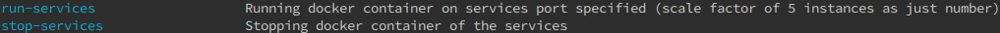

# lets_talk

real-time chat app demonstrating some architectural, testing, readability, clean-code and infrastructural skills as a profile for myself ;)

# Main Features

- user registration (username & password)
- see all the system's online users
- ability to send message (text) to all online users
- notify immediately when a new message come from another user(s) (real-time communication)
- no persistence of messages for any user on the backend side

# Current Desired Architecture State

# Current Architecture State

# Required tools to be installed

- [docker](https://www.docker.com/) # as container-runtime
- [docker-compose](https://docs.docker.com/compose/) # as container-orchestration (replaced by kubernetes later?)
- [make](https://www.gnu.org/software/make/) # as building/scripting tool

# Usage

- `$ make` # For all the possible commands currently available for the project
  

# Todo

- [ ] Enhancing security between services
- [ ] Enhancing security between messages (sent/receive)
- [ ] Scripts for building kubernetes infrastcuture automated
- [ ] Scripts for Chaos Engineerign for the system and it's infrastucture
