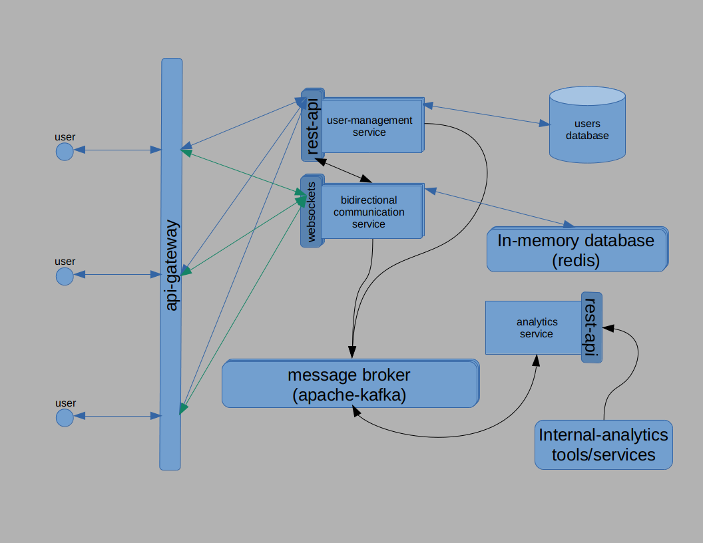

# lets_talk

real-time chat app demonstrating some architectural, testing, readability, clean-code and infrastructural skills as a profile for myself ;)

# Main Features

- user registration (username & password)
- see all the system's online users
- ability to send message (text) to any online user
- notify immediately if a user got a message from another user (real-time communication)
- no persistence of messages for any user on the backend side

# Current Desired Architecture State

# Current Architecture State

# Todo

- [ ] Enhancing security between services
- [ ] Enhancing security between messages (sent/receive)
- [ ] Scripts for building kubernetes infrastcuture automated
- [ ] Scripts for Chaos Engineerign for the system and it's infrastucture
