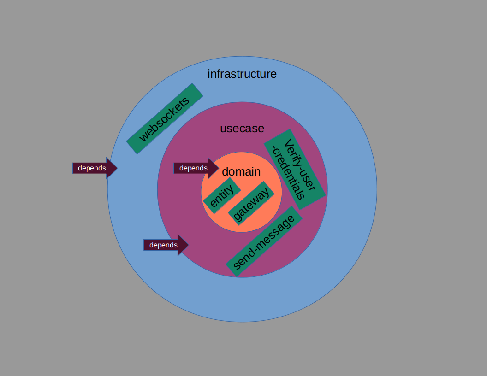
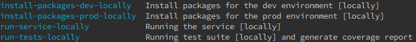

# bidirectional-communication-service

bidirectional-communication-service is for bidirectional communications (real-time chat service for now)

# Architecture [simplified onion/clean architecture](https://blog.cleancoder.com/uncle-bob/2012/08/13/the-clean-architecture.html)

# Explanation

- simple clean architecture implementation
- simple flask with websockets implementation (Plugins as needed to be changed)
- simple in-memory persistence of online user's state and maybe redis later? (Plugins as needed to be changed)

# Required tools to be installed

- [make](https://www.gnu.org/software/make/) # as building/scripting tool

# Usage

- `$ make` # For all the possible commands currently available for the project
  

### Example post request

# Todo
- [ ] Running tests inside docker containers (then we may test inter-services-communications using the same way as well)