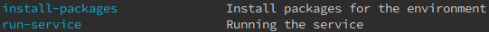

# frontend-cli

a very thin layer (cli) as a frontend to be using user-management and bidirectional-communication services behind the scene to show interactions as a whole real-time chat app example :)

# Architecture

in this app will be using very simple codebase so no need to be doing it in 'onion-architecture', just simple functions and scripts if needed :)

# Explanation

- simple cli-client implementation
- simple registration and login functionalities (using user-management service behind the scene)
- simple one to many text messages sending (using bidirectional-communication service behind the scene)

# Required tools to be installed

- [make](https://www.gnu.org/software/make/) # as building/scripting tool

# Usage

- `$ make` # For all the possible commands currently available for the project
  