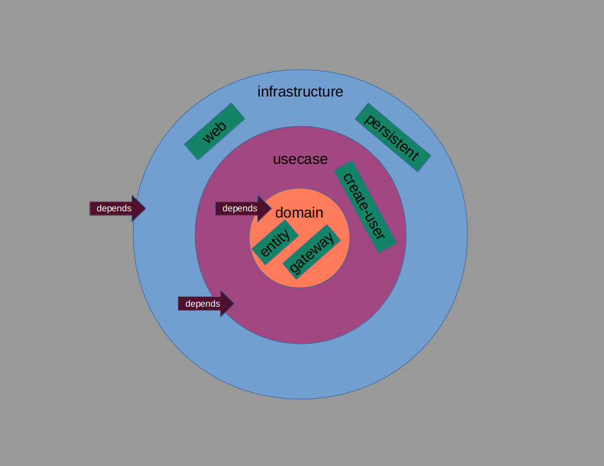
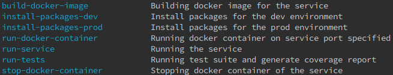

# User Management Service

This service is responsible of doing user logic like registrations

# Architecture [simplified onion/clean architecture](https://blog.cleancoder.com/uncle-bob/2012/08/13/the-clean-architecture.html)

# Explanation

- simple clean architecture implementation
- simple ~~in-memory~~ mongo database implementation (Plugins as needed to be changed)
- simple flask rest-api implementation (Plugins as needed to be changed)

# Required tools to be installed
- [docker](https://www.docker.com/)                    # as container-runtime
- [docker-compose](https://docs.docker.com/compose/)   # as container-orchestration (replaced by kubernetes later?)
- [make](https://www.gnu.org/software/make/)           # as building/scripting tool

# Usage

- `$ make` # For all the possible commands currently available for the project
  

### Example post request

- [http](https://httpie.org/) tool
  - `$ http post :3000/users name='abdulrahman' age=25 password='test' email='abmazhr@gmail.com'`
- [curl](https://curl.haxx.se) tool
  - `$ curl -d '{"name":"abdulrahman", "age": 25, "password": "test", "email": "abmazhr@gmail.com"}' -H "Content-Type: application/json" -X POST http://localhost:3000/users`

# Todo

- [x] ~~Implementing some sort of read database (mongodb) since with load-balancing we got different instances each with different in-memory database so data is not consisted, yet~~
- [x] ~~Adding configuration files to tweak service behaviours/preferences at runtime~~
- [x] ~~Using environment variables to dynamically tweak service/infrastructure behaviours/preferences~~
- [x] ~~Running tests inside docker containers (then we may test mongodb using the same way as well)~~
- [ ] Adding auth/jwt mechanism if needed user communications later (better be)
